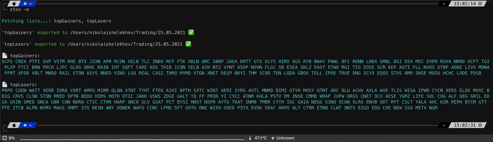

# stox
A Swift command-line tool to view and export tickers from finviz.com stock screener.

<p align="center">
  
  
  <a href="https://twitter.com/twannl">
      
  </a>
</p>


Stox helps you with:

- [x] Create and save watchlists from stock screener URL's
- [x] View and export tickers



### Requirements
- Xcode 12.4 and up

## Installation

### Using [Mint](https://github.com/yonaskolb/mint):

```
$ mint install xbladesub/stox
```

### Development
- `cd` into the repository
- run `swift package generate-xcodeproj` (Generates an Xcode project for development)
- Run the following command to try it out:

```bash
$ swift run stox --help
```

## Usage

### Create lists

```
$ stox new
```


### Change export settings

```
$ stox set
```


```
$ stox --help

OVERVIEW: Display and export stock tickers from 'finviz.com' screener URLs

USAGE: stox <subcommand>

OPTIONS:
  --version               Show the version.
  -h, --help              Show help information.

SUBCOMMANDS:
  list (default)          View or export tickers from given lists
  all                     View or export all tickers from all lists
  new                     Create new tickers list by a given screener URL
  del                     Delete tickers lists
  set                     Specify tickers export options
  dir                     Display tickers export directory
```
